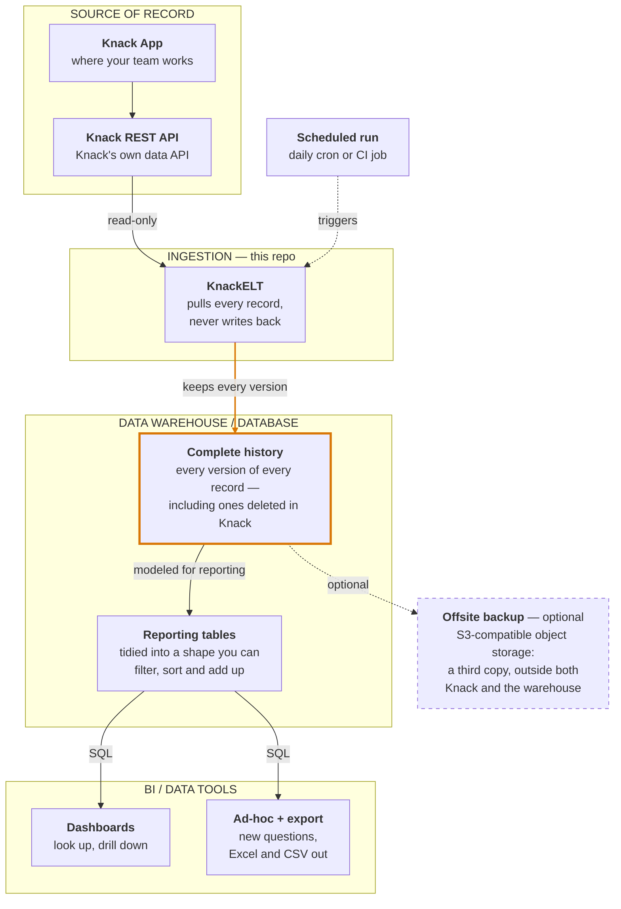

# KnackELT

**Get your data out of Knack and into a real database — on a schedule, read-only, with full history.**

Knack is a good place to *run* a business and a poor place to *remember* one. Every plan caps
how many records you can hold, there is no SQL and no aggregates, and once a record is deleted
it is gone.

KnackELT copies every record out through Knack's own REST API and keeps **every version of every
row**. Nothing is ever overwritten, so the warehouse can still answer questions about records
your app no longer has. It is built on [dlt](https://dlthub.com), and it never writes back to
Knack.

## How it fits together



**This repo is the `INGESTION` box.** Everything flows one way: KnackELT reads through the same
REST API your app already exposes, so it cannot alter or break anything in Knack. The amber box
is the point of the exercise — your app deletes records to stay under its limit, and the
warehouse keeps them anyway.

The other boxes are deliberately generic. KnackELT loads into anything
[dlt supports as a destination](https://dlthub.com/docs/dlt-ecosystem/destinations/), and any
BI tool that speaks SQL to that destination will do. For a concrete, working combination of all
four — MotherDuck, dbt and Preset, orchestrated by a daily GitHub Actions job — see
[docs/ARCHITECTURE.md](docs/ARCHITECTURE.md).

## What it does

- **Discovers your schema.** Reads the Knack application metadata and builds a resource per
  object, so there is no table list to maintain. Add an object in Knack and the next run picks
  it up.
- **Gives you readable column names.** `field_43` becomes `event_name`, slugified from the field
  label you already chose in the builder. Knack's own row id is loaded as `record_id`, so a
  field you named `id` keeps the `id` column it was named for.
- **Cleans what the API hands back.** Empty strings become `NULL` in numeric fields, and
  boolean fields get the default declared in Knack, so a column of numbers types as numbers
  rather than as text full of `''`.
- **Keeps history.** Loads with dlt's SCD2 merge strategy keyed on the Knack record id, so an
  edit retires the old row and appends a new one. Tables are kept flat
  (`max_table_nesting=0`) — one table per Knack object, no nested child tables.

## Install

Requires **Python 3.13+**. Published on PyPI as
[`knack-elt`](https://pypi.org/project/knack-elt/). Pick whichever fits:

### Run it without installing

[uv](https://docs.astral.sh/uv/) fetches the package into a throwaway environment, so this
leaves nothing behind — the quickest way to point it at an app and see what comes out:

```bash
uvx --from knack-elt knack-elt run-pipeline --app-id your_app_id
```

### Install the CLI

For repeated use, install it as a standalone tool. `uv tool` and `pipx` both keep it in its
own environment rather than in your project or system site-packages:

```bash
uv tool install knack-elt      # or: pipx install knack-elt
knack-elt --version
```

Plain `pip` works too, though prefer a virtualenv over a system-wide install:

```bash
python -m pip install knack-elt
```

### Clone for development

Use this if you intend to change the code. `uv sync` builds the environment from the
lockfile, so you get the exact dependency versions CI tests against:

```bash
git clone https://github.com/mcmasty/knack-elt.git
cd knack-elt
uv sync
uv run knack-elt --version
uv run pytest tests/ -q      # offline: no Knack or MotherDuck credentials needed
```

In a clone, prefix the commands below with `uv run`. Installed via any of the other routes,
call `knack-elt` directly.

## Quick start

```bash
export KNACK_APP_ID=your_app_id
export KNACK_API_KEY=your_rest_api_key

knack-elt run-pipeline --app-id "$KNACK_APP_ID"
```

Your Knack REST API key comes from the Knack builder under **Settings → API & Code**. The
pipeline only ever reads.

Names are derived from your app's slug, so a second app never lands on the first one's tables:
database `knack_{slug}_data`, dataset `{slug}`, pipeline `knack_{slug}_pipeline`.

### Destinations

`--destination local` (the default) writes a DuckDB file — nothing to sign up for, so a fresh
install can be pointed at a Knack app and produce a queryable warehouse immediately.

The file goes to `$XDG_DATA_HOME/knack-elt/knack_{slug}_data.duckdb`, falling back to
`~/.local/share/knack-elt/`. That location is deliberately **not** relative to the working
directory: the same app must keep one warehouse wherever you run the command, or a record's
SCD2 history silently splits across directories. Pass `--db-path` to put it somewhere else.
The resolved absolute path is printed on every run.

```bash
knack-elt run-pipeline --app-id "$KNACK_APP_ID" --db-path ~/knack.duckdb
knack-elt run-pipeline --app-id "$KNACK_APP_ID" --destination motherduck
```

`--destination motherduck` loads to `md:///knack_{slug}_data` and needs `motherduck_api_key`
in the environment. Both destinations also write the run's `_load_info` and `_trace` tables.

### Other flags

| Flag | What it does |
| --- | --- |
| `--api-key` | Knack REST API key, if you would rather not set `KNACK_API_KEY` |
| `--refresh-metadata` | Re-fetch app metadata instead of reusing knack-sleuth's 24h on-disk cache |
| `--skip-unreadable` | Log and continue past objects that fail *before yielding any row* (typically no read permission). An object that fails partway through still aborts the run — loading a partial batch would retire live SCD2 rows as if the missing records had been deleted in Knack. |

## Configuration

Read from the environment or a `.env` file via `pydantic-settings`
([`src/knack_elt/config.py`](src/knack_elt/config.py)):

| Variable | Purpose |
| --- | --- |
| `KNACK_APP_ID` | Knack application id — also the default for `--app-id` |
| `KNACK_API_KEY` | Knack REST API key, sent as `X-Knack-REST-API-Key` |
| `motherduck_api_key` | MotherDuck token, when the destination is MotherDuck |

## Querying what you get

Because loads are SCD2, a record's history is several rows sharing one `record_id`, tagged with
`_dlt_valid_from` and `_dlt_valid_to`. Two flags are worth deriving up front — conflating them
is the most common way to get a wrong answer:

```sql
with flagged as (
    select
        *,
        row_number() over (partition by record_id order by _dlt_valid_from desc) = 1
            as latest_version,      -- one row per record
        _dlt_valid_to is null as is_live_in_knack   -- still in the app?
    from your_dataset.some_table
)
select * from flagged where latest_version
```

A record deleted in Knack survives only as a *retired* row, so filtering on
`_dlt_valid_to is null` alone silently drops exactly the history you built the warehouse for.
And aggregating without `latest_version` double-counts, because every past version is still a
row. The [architecture doc](docs/ARCHITECTURE.md#4-scd2-row-lifecycle) works through both.

> **One caveat on `is_live_in_knack`.** If an object returns *zero* records, dlt has nothing to
> load for that table and the merge never runs, so rows loaded earlier keep `_dlt_valid_to is
> null` and still read as live. Emptying an object in Knack is therefore invisible to the flag —
> a table whose row count stops moving is worth checking against the app.

## Documentation

- **[docs/ARCHITECTURE.md](docs/ARCHITECTURE.md)** — the reference architecture in plain language
  and in technical detail, the pipeline internals, a run sequence, and the SCD2 row model with
  the query patterns it requires. Also available as a [PDF](docs/ARCHITECTURE.pdf).

The PDF is generated from the markdown rather than maintained alongside it. After editing
the diagrams, rebuild it with `uv run scripts/build_architecture_pdf.py` (needs node and
Chrome) so the two don't drift apart.

## Related

- [dlt](https://dlthub.com) — the load framework this is built on
- `knack-sleuth` — Knack application metadata models and schema export, used here to read your
  app's structure

## License

GPL-3.0. See [LICENSE](LICENSE).
