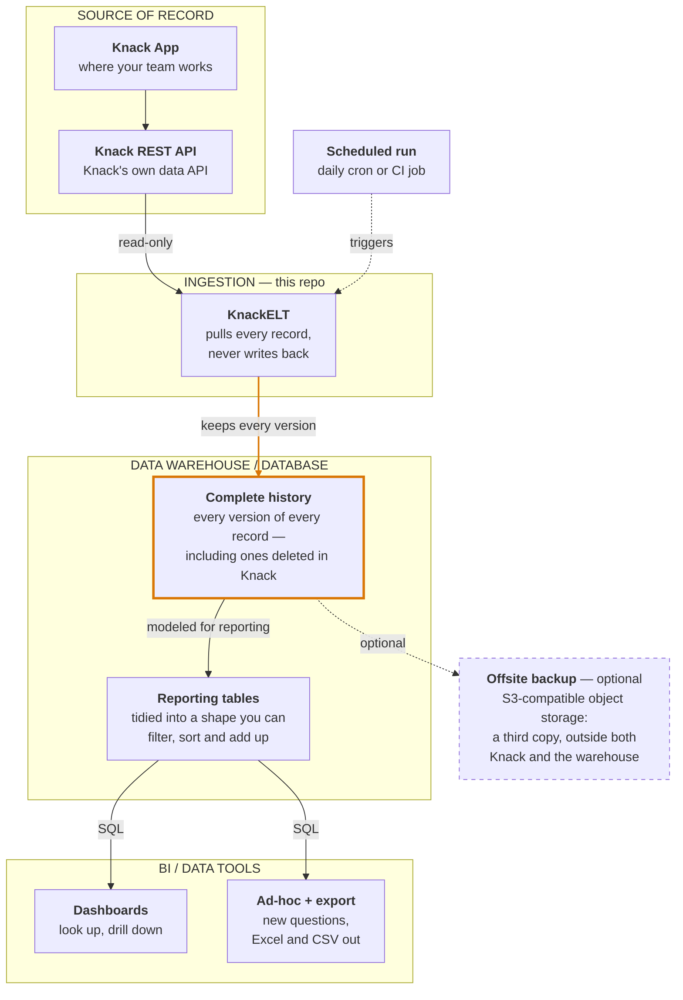

# KnackELT

**Get your data out of Knack and into a real database — on a schedule, read-only, with full history.**

Knack is a good place to *run* a business and a poor place to *remember* one. Every plan caps
how many records you can hold, there is no SQL and no aggregates, and once a record is deleted
it is gone.

KnackELT copies every record out through Knack's own REST API and keeps **every version of every
row**. Nothing is ever overwritten, so the warehouse can still answer questions about records
your app no longer has. It is built on [dlt](https://dlthub.com), and it never writes back to
Knack.

## How it fits together



**This repo is the `INGESTION` box.** Everything flows one way: KnackELT reads through the same
REST API your app already exposes, so it cannot alter or break anything in Knack. The amber box
is the point of the exercise — your app deletes records to stay under its limit, and the
warehouse keeps them anyway.

The other boxes are deliberately generic. KnackELT loads into anything
[dlt supports as a destination](https://dlthub.com/docs/dlt-ecosystem/destinations/), and any
BI tool that speaks SQL to that destination will do. For a concrete, working combination of all
four — MotherDuck, dbt and Preset, orchestrated by a daily GitHub Actions job — see
[docs/ARCHITECTURE.md](docs/ARCHITECTURE.md).

## What it does

- **Discovers your schema.** Reads the Knack application metadata and builds a resource per
  object, so there is no table list to maintain. Add an object in Knack and the next run picks
  it up.
- **Keeps schema identities stable.** Physical tables and columns use Knack's immutable
  `object_N` and `field_N` keys, so renaming an app, object or field cannot split history or
  silently move current values. `_kn_object_catalog` and `_kn_field_catalog` keep the current
  human-readable labels beside those keys. Knack's own row id is loaded as `record_id`.
- **Cleans what the API hands back.** Empty strings become `NULL` in numeric fields, and
  boolean fields get the default declared in Knack, so a column of numbers types as numbers
  rather than as text full of `''`.
- **Keeps history.** Loads with dlt's SCD2 merge strategy keyed on the Knack record id, so an
  edit retires the old row and appends a new one. Tables are kept flat
  (`max_table_nesting=0`) — one table per Knack object, no nested child tables.

## Install

Requires **Python 3.13+**. Published on PyPI as
[`knack-elt`](https://pypi.org/project/knack-elt/). Pick whichever fits:

### Run it without installing

[uv](https://docs.astral.sh/uv/) fetches the package into a throwaway environment, so this
leaves nothing behind — the quickest way to point it at an app and see what comes out:

```bash
uvx --from knack-elt knack-elt run-pipeline --app-id your_app_id
```

No database to provision first: with no `--destination`, the run writes a local DuckDB file, so
a Knack app id and REST API key are the only things you need to get a queryable warehouse. It
goes to

```
$XDG_DATA_HOME/knack-elt/knack_{stable_app_id}_data.duckdb
```

falling back to `~/.local/share/knack-elt/` when `XDG_DATA_HOME` is unset. The resolved absolute
path is printed on every run, and `--db-path` overrides it — see
[Destinations](#destinations) for why that location is not relative to the working directory.

The throwaway environment is the Python install, not the data: that file stays put after the
`uvx` environment is gone, so a later run — via `uvx` or an installed CLI — picks up the same
warehouse and keeps accumulating SCD2 history.

### Install the CLI

For repeated use, install it as a standalone tool. `uv tool` and `pipx` both keep it in its
own environment rather than in your project or system site-packages:

```bash
uv tool install knack-elt      # or: pipx install knack-elt
knack-elt --version
```

Plain `pip` works too, though prefer a virtualenv over a system-wide install:

```bash
python -m pip install knack-elt
```

### Clone for development

Use this if you intend to change the code. `uv sync` builds the environment from the
lockfile, so you get the exact dependency versions CI tests against:

```bash
git clone https://github.com/mcmasty/knack-elt.git
cd knack-elt
uv sync
uv run knack-elt --version
uv run pytest tests/ -q      # offline: no Knack or MotherDuck credentials needed
```

In a clone, prefix the commands below with `uv run`. Installed via any of the other routes,
call `knack-elt` directly.

## Quick start

```bash
export KNACK_APP_ID=your_app_id
export KNACK_API_KEY=your_rest_api_key

knack-elt run-pipeline --app-id "$KNACK_APP_ID"
```

Your Knack REST API key comes from the Knack builder under **Settings → API & Code**. The
pipeline only ever reads.

Physical names derive from the immutable app id, not the editable app slug. The CLI prints the
safe `{stable_app_id}` it derives, then uses database `knack_{stable_app_id}_data`, dataset
`{stable_app_id}`, and pipeline `knack_{stable_app_id}_pipeline`.

### Destinations

`--destination local` (the default) writes a DuckDB file — nothing to sign up for, so a fresh
install can be pointed at a Knack app and produce a queryable warehouse immediately.

The file goes to `$XDG_DATA_HOME/knack-elt/knack_{stable_app_id}_data.duckdb`, falling back to
`~/.local/share/knack-elt/`. That location is deliberately **not** relative to the working
directory: the same app must keep one warehouse wherever you run the command, or a record's
SCD2 history silently splits across directories. Pass `--db-path` to put it somewhere else.
The resolved absolute path is printed on every run.

```bash
knack-elt run-pipeline --app-id "$KNACK_APP_ID" --db-path ~/knack.duckdb
knack-elt run-pipeline --app-id "$KNACK_APP_ID" --destination motherduck
```

`--destination motherduck` loads to `md:///knack_{stable_app_id}_data` and needs
`motherduck_api_key` in the environment. Both destinations also write the run's `_load_info`,
`_trace`, `_kn_object_catalog`, and `_kn_field_catalog` tables.

> **Naming migration:** older releases derived databases, datasets, tables and columns from
> editable labels. Stable key-based naming intentionally starts a new physical namespace.
> Preserve an existing warehouse and migrate its history deliberately; do not delete the old
> DuckDB file or MotherDuck database after upgrading. On a local run, the CLI prints a
> note when a slug-named warehouse from an earlier release is still sitting beside the
> new one.

### Label views

Physical tables and columns are keyed on immutable Knack ids — `object_N` tables, `field_N`
columns — which is what keeps a rename in the Knack builder from splitting a record's SCD2
history. The cost is that the warehouse alone is not friendly to browse: finding out that
`object_3` is "Customers" means joining against `_kn_object_catalog`.

`knack-elt refresh-views` builds a disposable layer of views for that, in a schema separate from
the data — `{stable_app_id}_labels` beside `{stable_app_id}` — named after the labels currently
in `_kn_object_catalog` and `_kn_field_catalog`. Two views per object:

- `"Customers"` — live rows only, columns aliased to current field labels. Point a BI tool here.
- `"Customers_history"` — every version of every row, including ones deleted in Knack, plus
  `valid_from` / `valid_to` / `is_live_in_knack`. The split exists because "current" has two
  meanings under SCD2 — a view that only showed live rows would silently drop exactly the
  records the warehouse exists to keep, so the history form keeps them visible under a name that
  says what they are.

The layer is views only: it never renames or restructures anything under `object_N` / `field_N`,
it just reads from it.

```bash
knack-elt refresh-views --app-id acme_ops_app_id
```

The command reads the label catalogs already in the warehouse — no Knack API key, no network —
so the views reflect labels as of the *last sync*, not this instant. If those catalogs don't
exist yet — a warehouse `run-pipeline` has never touched, or a mistyped `--db-path` — it is a
hard error naming the resolved database path, rather than reading as "zero objects" and quietly
dropping the whole view layer. Otherwise it prints a plan (renames, column changes, creations,
drops) and asks before applying it. One case asks even under `--yes`: a plan that would drop
every view and create none, which is what a genuinely emptied app looks like, so it always gets
a human even in scripted use.

A label edit in the Knack builder must never move a warehouse name on its own: `refresh-views` is
the only command that changes the view layer, and it always asks first. `run-pipeline` only
*reports* drift at the end of a sync — which objects and fields have been renamed since the views
were last built — it never applies it.

The `{stable_app_id}_labels` schema is entirely knack-elt-managed: every `refresh-views` apply
drops and rebuilds the whole thing in one transaction, so a hand-authored **view** placed there
is removed on the next run. A hand-authored **table** is left alone but blocks the apply — DuckDB
won't let a view replace a table — and the error names it so it can be dropped by hand.

### Naming the warehouse yourself

By default every physical name derives from the immutable app id. `--name` (or
`KNACK_WAREHOUSE_NAME` in the environment or `.env`) overrides that in one place: the database
becomes `knack_{name}_data`, the dataset `{name}`, and the label views schema `{name}_labels`.
This exists for deliberate adoption — a deployment that already has a warehouse called
`knack_acme_ops_data.acme_ops` and wants knack-elt to keep writing there.

The name is validated, never transformed: lowercase letter first, then lowercase letters,
digits and underscores. Anything else is an error, because a name that silently becomes
something else is how one app ends up with two warehouses.

**Once chosen, use it every run** — put it in `.env` rather than typing it. A run with the
name and a run without it write to two different warehouses, silently splitting a record's
SCD2 history. On local runs the CLI prints a note when it sees a warehouse under this app's
other naming sitting beside the one it is using.

### Other flags

| Flag | What it does |
| --- | --- |
| `--api-key` | Knack REST API key, if you would rather not set `KNACK_API_KEY` |
| `--name` | Pin the warehouse/dataset names instead of deriving them from the app id (see above) |
| `--refresh-metadata` | Re-fetch app metadata instead of reusing knack-sleuth's 24h on-disk cache |
| `--skip-unreadable` | Log and continue past an object only when its first request returns HTTP 403. Authentication failures, rate limits, timeouts, server errors and failures after any row was yielded still abort the run. |

## Configuration

Read from the environment or a `.env` file via `pydantic-settings`
([`src/knack_elt/config.py`](src/knack_elt/config.py)):

| Variable | Purpose |
| --- | --- |
| `KNACK_APP_ID` | Knack application id — also the default for `--app-id` |
| `KNACK_API_KEY` | Knack REST API key, sent as `X-Knack-REST-API-Key` |
| `motherduck_api_key` | MotherDuck token, when the destination is MotherDuck |

## Querying what you get

Because loads are SCD2, a record's history is several rows sharing one `record_id`, tagged with
`_dlt_valid_from` and `_dlt_valid_to`. Two flags are worth deriving up front — conflating them
is the most common way to get a wrong answer:

```sql
with flagged as (
    select
        *,
        row_number() over (partition by record_id order by _dlt_valid_from desc) = 1
            as latest_version,      -- one row per record
        _dlt_valid_to is null as is_live_in_knack   -- still in the app?
    from your_dataset.some_table
)
select * from flagged where latest_version
```

A record deleted in Knack survives only as a *retired* row, so filtering on
`_dlt_valid_to is null` alone silently drops exactly the history you built the warehouse for.
And aggregating without `latest_version` double-counts, because every past version is still a
row. The [architecture doc](docs/ARCHITECTURE.md#4-scd2-row-lifecycle) works through both.

> **Source-consistency caveat.** Knack's record API pages by number,
> not by cursor, so a record inserted or deleted *while a multi-page extraction is running*
> shifts the page boundaries under it, and a record can slide across a boundary and be missed.
> A missed record can therefore be retired as though it were deleted.
>
> The pipeline has a best-effort check. Every Knack page response carries a `total_records`, and a run
> that fetches fewer records than Knack reported it held throughout **aborts instead of loading
> the batch** — the merge never gets the chance to retire the missing rows. Re-run it and the
> load can succeed. Equal-count concurrent insertion/deletion can evade this test, so schedule
> snapshots during a quiet period. The window is widest on the biggest tables.
>
> If Knack's response ever omits `total_records`, the check is skipped rather than failing
> closed, and the original hazard applies: a missed record is retired as deleted. That mostly
> self-corrects — the next run sees it again and re-adds it, so `latest_version and
> is_live_in_knack` is right again within a day, and a record would have to be missed the same
> way on consecutive runs to look durably gone. What does *not* self-correct is the history. The
> spurious retirement and re-add stay in the table permanently, so a point-in-time query
> (`_dlt_valid_from <= d and (_dlt_valid_to is null or _dlt_valid_to > d)`) over that window
> reports the record as deleted when it never was. Once is enough for that.
>
> Confirmed-empty objects and objects removed from metadata are handled separately after a
> successful load: their remaining live rows are explicitly retired.

## Documentation

- **[docs/ARCHITECTURE.md](docs/ARCHITECTURE.md)** — the reference architecture in plain language
  and in technical detail, the pipeline internals, a run sequence, and the SCD2 row model with
  the query patterns it requires. Also available as a [PDF](docs/ARCHITECTURE.pdf).

The PDF is generated from the markdown rather than maintained alongside it. After editing
the diagrams, rebuild it with `uv run scripts/build_architecture_pdf.py` (needs node and
Chrome) so the two don't drift apart.

## Related

- [dlt](https://dlthub.com) — the load framework this is built on
- `knack-sleuth` — Knack application metadata models and schema export, used here to read your
  app's structure

## License

GPL-3.0. See [LICENSE](LICENSE).
