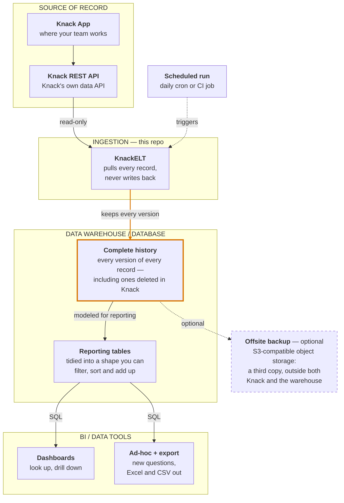

# KnackELT

**Get your data out of Knack and into a real database — on a schedule, read-only, with full history.**

Knack is a good place to *run* a business and a poor place to *remember* one. Every plan caps
how many records you can hold, there is no SQL and no aggregates, and once a record is deleted
it is gone.

KnackELT copies every record out through Knack's own REST API and keeps **every version of every
row**. Nothing is ever overwritten, so the warehouse can still answer questions about records
your app no longer has. It is built on [dlt](https://dlthub.com), and it never writes back to
Knack.

## How it fits together



**This repo is the `INGESTION` box.** Everything flows one way: KnackELT reads through the same
REST API your app already exposes, so it cannot alter or break anything in Knack. The amber box
is the point of the exercise — your app deletes records to stay under its limit, and the
warehouse keeps them anyway.

The other boxes are deliberately generic. KnackELT loads into anything
[dlt supports as a destination](https://dlthub.com/docs/dlt-ecosystem/destinations/), and any
BI tool that speaks SQL to that destination will do. For a concrete, working combination of all
four — MotherDuck, dbt and Preset, orchestrated by a daily GitHub Actions job — see
[docs/ARCHITECTURE.md](docs/ARCHITECTURE.md).

## What it does

- **Discovers your schema.** Reads the Knack application metadata and builds a resource per
  object, so there is no table list to maintain. Add an object in Knack and the next run picks
  it up.
- **Gives you readable column names.** `field_43` becomes `event_name`, slugified from the field
  label you already chose in the builder. A field you named `id` is renamed rather than
  colliding with Knack's own record id.
- **Cleans what the API hands back.** Empty strings become `NULL` in numeric fields, boolean
  fields get the default declared in Knack, and malformed JSON becomes `NULL` instead of
  failing the load.
- **Keeps history.** Loads with dlt's SCD2 merge strategy keyed on the Knack record id, so an
  edit retires the old row and appends a new one. Tables are kept flat
  (`max_table_nesting=0`) — one table per Knack object, no nested child tables.

## Quick start

Requires Python 3.13+ and [uv](https://docs.astral.sh/uv/).

```bash
uv sync

export KNACK_APP_ID=your_app_id
export KNACK_API_KEY=your_rest_api_key

uv run knack-elt run-pipeline --app-id "$KNACK_APP_ID"
```

Names are derived from your app's slug, so a second app never lands on the first one's tables:
database `knack_{slug}_data`, dataset `{slug}`, pipeline `knack_{slug}_pipeline`.

> **Note on destinations.** `run-pipeline` currently writes to a local DuckDB file under
> `tests/data/`. The MotherDuck destination is present but commented out in
> [`src/knack_elt/cli.py`](src/knack_elt/cli.py); making it a flag is the next obvious step.
> Running `python -m knack_elt.knack_dlt` takes the older path, which does write to MotherDuck.

## Configuration

Read from the environment or a `.env` file via `pydantic-settings`
([`src/knack_elt/config.py`](src/knack_elt/config.py)):

| Variable | Purpose |
| --- | --- |
| `KNACK_APP_ID` | Knack application id — also the default for `--app-id` |
| `KNACK_API_KEY` | Knack REST API key, sent as `X-Knack-REST-API-Key` |
| `motherduck_api_key` | MotherDuck token, when the destination is MotherDuck |

## Querying what you get

Because loads are SCD2, a record's history is several rows sharing one `id`, tagged with
`_dlt_valid_from` and `_dlt_valid_to`. Two flags are worth deriving up front — conflating them
is the most common way to get a wrong answer:

```sql
with flagged as (
    select
        *,
        row_number() over (partition by id order by _dlt_valid_from desc) = 1
            as latest_version,      -- one row per record
        _dlt_valid_to is null as is_live_in_knack   -- still in the app?
    from your_dataset.some_table
)
select * from flagged where latest_version
```

A record deleted in Knack survives only as a *retired* row, so filtering on
`_dlt_valid_to is null` alone silently drops exactly the history you built the warehouse for.
And aggregating without `latest_version` double-counts, because every past version is still a
row. The [architecture doc](docs/ARCHITECTURE.md#4-scd2-row-lifecycle) works through both.

## Documentation

- **[docs/ARCHITECTURE.md](docs/ARCHITECTURE.md)** — the reference architecture in plain language
  and in technical detail, the pipeline internals, a run sequence, and the SCD2 row model with
  the query patterns it requires. Also available as a [PDF](docs/ARCHITECTURE.pdf).

The PDF is generated from the markdown rather than maintained alongside it. After editing
the diagrams, rebuild it with `uv run scripts/build_architecture_pdf.py` (needs node and
Chrome) so the two don't drift apart.

## Related

- [dlt](https://dlthub.com) — the load framework this is built on
- `knack-sleuth` — Knack application metadata models and schema export, used here to read your
  app's structure

## License

GPL-3.0. See [LICENSE](LICENSE).
