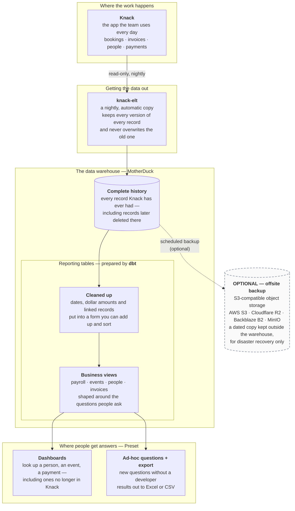
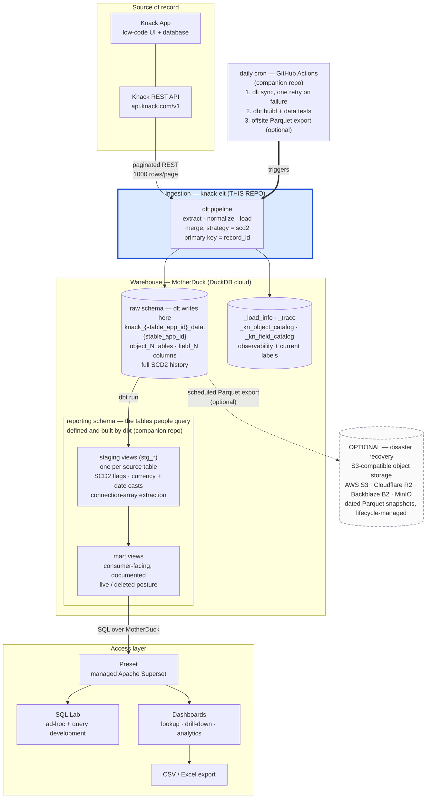
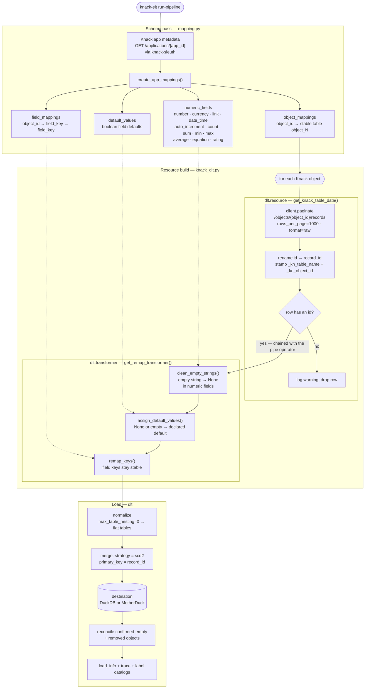
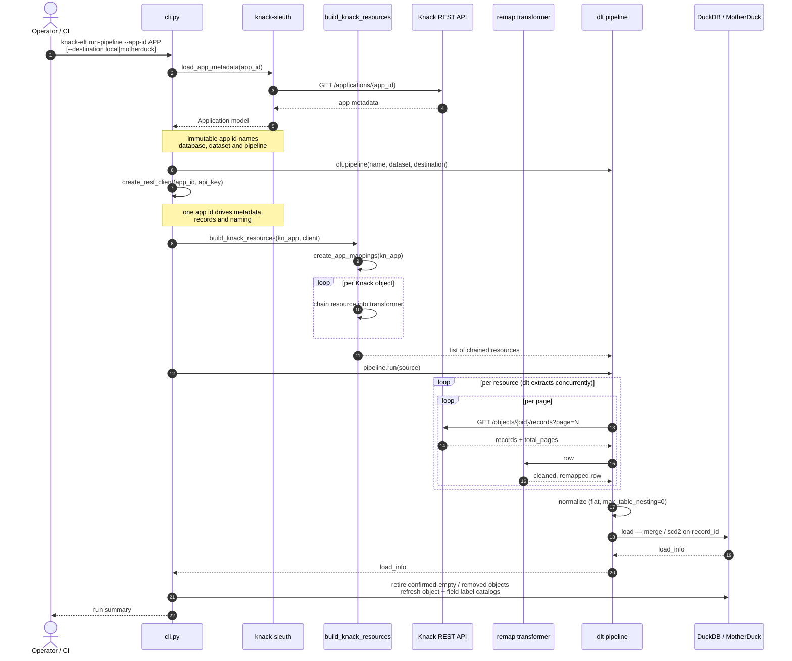
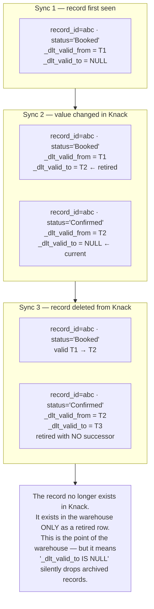

# KnackELT Architecture

How knack-elt works, and where it sits in a full Knack → warehouse → BI stack.

Four diagrams:

1. [Reference architecture](#1-reference-architecture) — the end-to-end stack,
   in [plain language](#the-stack-in-plain-language) and with [the technical detail](#the-same-stack-with-the-technical-detail)
2. [Pipeline flow](#2-pipeline-flow) — what knack-elt actually does on a run
3. [Run sequence](#3-run-sequence) — the call order for one invocation
4. [SCD2 row lifecycle](#4-scd2-row-lifecycle) — how history is represented, and how to query it

> **Scope note.** This repo is the **ingestion** piece only. The dbt models, BI
> configuration, and CI orchestration shown in diagram 1 are drawn from a working
> production deployment where they live in a companion application repo (whose
> `pipelines/knack_dlt.py` is the production twin of this repo's pipeline). They are
> real, not aspirational — but they are not in this tree. Subgraph labels mark what
> lives where.

---

## 1. Reference architecture

Knack is the system of record and the operational UI. It is not a warehouse: no
SQL, no aggregates, no history, and a record cap that eventually forces pruning.
The stack below turns it into one — MotherDuck as the warehouse, dbt as the
transformation layer, Preset (managed Apache Superset) as the access layer.

Same architecture, drawn twice: once for a stakeholder audience, once with the
detail an engineer needs.

### The stack in plain language



**How to read it.** The copy runs one way only — nothing this stack does can change
data in Knack. The warehouse keeps history, so a record deleted in Knack is still
answerable afterwards; that is the whole point of having it. The two boxes inside
the warehouse are a division of labour, not two copies of the data: the complete
history is what arrives, and **dbt** is the tool that turns it into the cleaned,
business-shaped tables people actually query.

The dashed box is genuinely optional. The warehouse is already a second copy of
Knack, so this is a third — insurance against losing the *warehouse* (a bad
migration, an account problem, a provider outage), not against losing Knack. Add
it when the warehouse becomes the only remaining copy of pruned records; skip it
while Knack still holds everything. Any S3-compatible store works, and retention
is normally handled by the bucket's own lifecycle rules rather than by code.

### The same stack, with the technical detail



**The load-bearing detail: schema ownership is split.**

| Schema | Owner | Contents | Rule |
|---|---|---|---|
| raw (the stable app-id dataset) | dlt | One `object_N` table per Knack object, `field_N` columns, full SCD2 history | **dbt never builds into it.** It is the pipeline's output, and a `dbt run` writing here would be clobbered on the next sync. |
| `reporting` | dbt | Staging + mart views | Everything downstream reads here. No dashboard queries raw directly. |

Staging exists so that exactly one layer absorbs the mess Knack and dlt produce
together — currency strings with commas, dates wrapped in JSON, connection fields
as JSON arrays, and dlt's type-variant columns (when a value doesn't fit the type
inferred from the first batch, dlt NULLs the base column and diverts the value to
a sibling like `amount__v_double`, which makes a naive `SUM()` under-report
silently). Marts and dashboards then get to be simple.

**Why Preset:** it is managed Superset, so SQL Lab doubles as the query-development
environment and the dashboard builder against the same MotherDuck connection —
a proven query becomes a dataset becomes a chart with no rewrite. Any BI tool with
a DuckDB/MotherDuck SQLAlchemy connection substitutes here; the contract is the
`reporting` schema, not the tool. Note that row-level security and embedded
analytics are paid-tier features in Preset — untrusted multi-tenant self-service
needs a different surface (a scoped API in front of MotherDuck), not a BI seat.

---

## 2. Pipeline flow

What one run of knack-elt does. Two inputs from Knack: the **app metadata**
(schema) and the **records** (data). Immutable keys identify physical tables and
columns; metadata labels are loaded into catalog tables for discovery.



**Notes on the mapping pass**

- Object and field labels are editable metadata, so they never identify physical warehouse
  objects. `object_12` remains table `object_12`; `field_73` remains column `field_73`.
- `_kn_object_catalog` and `_kn_field_catalog` map those stable keys to current labels for
  discovery and downstream model generation.
- Label changes, duplicate/non-Latin labels, and names matching top-level system keys therefore
  cannot split history or overwrite a value.
- Knack's row id arrives as the top-level `id` key and is renamed to `record_id`, which
  is the pipeline's primary key. A field labelled "ID" remains under its immutable `field_N`
  column. The key is taken from the payload, not from Knack's auto-added "Record ID" field, so it
  works identically on apps that predate that field.
- Cleaning runs **before** the remap only, so it matches on raw Knack field keys.
  `numeric_fields` and `default_values` are registered under those raw keys only.
- `remap_keys` falls back to the original key when no mapping exists, so an unmapped
  object still loads — with `field_NN` column names.

---

## 3. Run sequence

The packaged entry point is the Typer CLI (`knack-elt run-pipeline`). It takes the
app metadata from knack-sleuth rather than fetching it itself, and builds the record
client from the *same* app id and key, so metadata and records always describe one app.



**One entry point, two destinations:**

| `--destination` | Target | Requires |
|---|---|---|
| `local` (default) | a DuckDB file at `$XDG_DATA_HOME/knack-elt/knack_{stable_app_id}_data.duckdb` (falling back to `~/.local/share/knack-elt/`), or wherever `--db-path` points. Deliberately not working-directory relative — one app, one warehouse, wherever the command runs | nothing — this is the zero-setup path, so a fresh install can load a Knack app straight away |
| `motherduck` | `md:///knack_{stable_app_id}_data` | `motherduck_api_key` in the environment or `.env` |

Either way the run sets `load.workers = 3` and `truncate_staging_dataset = True`, reconciles
confirmed-empty and removed objects, and writes `_load_info`, `_trace`, `_kn_object_catalog`
and `_kn_field_catalog` beside the data.

The application id and REST API key are threaded from the CLI into the record client, so
`--app-id` alone fully determines which app is read — metadata and records cannot disagree.

---

## 4. SCD2 row lifecycle

Every table is loaded with `write_disposition={"disposition": "merge", "strategy": "scd2"}`,
so the warehouse is **append-and-retire, not overwrite**. dlt adds `_dlt_valid_from`
and `_dlt_valid_to` to every row. A record's history is therefore several rows sharing
one `record_id`.



Because of that last case, two different flags are needed, and conflating them is
the most common way to get a wrong answer out of this stack:

```sql
-- one row per record, live or deleted, plus the live/deleted flag
with flagged as (
    select
        *,
        row_number() over (partition by record_id order by _dlt_valid_from desc) = 1
            as latest_version,
        _dlt_valid_to is null as is_live_in_knack
    from acme_ops.some_table         -- the raw, dlt-owned schema
)
select * from flagged where latest_version
```

| Question | Filter |
|---|---|
| Current state of everything still in Knack | `latest_version and is_live_in_knack` |
| Latest known state of every record ever seen, including deleted | `latest_version` |
| What did this record look like on a given date | `_dlt_valid_from <= d and (_dlt_valid_to is null or _dlt_valid_to > d)` |
| What has been deleted from Knack | `latest_version and not is_live_in_knack` |

Two traps worth stating explicitly:

- **Partition by `record_id`, not by a column that looks like an id.** `record_id` is the
  canonical Knack row id, taken from the API payload and populated on every row. A `field_N`
  column may hold the app's own numbering or Knack's auto-added Record ID field, but neither
  is the merge key. Partitioning on either collapses rows into wrong groups and corrupts the
  flags.
- **Aggregate without `latest_version` and you double-count.** Every historical
  version of a row is still a row. A `SUM()` over the raw table sums every version
  of every record.

Deleted-in-Knack is not the same as *archived by policy* — distinguishing an
intentional retention prune from incidental deletion needs a separate manifest of
what the pruning process removed; SCD2 alone cannot tell them apart.

---

## Configuration

`pydantic-settings`, loaded from environment or `.env` (`src/knack_elt/config.py`):

| Variable | Used for |
|---|---|
| `KNACK_APP_ID` | Knack application id — also the default for `--app-id` |
| `KNACK_API_KEY` | Knack REST API key (sent as `X-Knack-REST-API-Key`) |
| `motherduck_api_key` | MotherDuck token, interpolated into the `md:///` connection string |

Note that dbt-duckdb reads the MotherDuck token from `motherduck_token`, not
`motherduck_api_key` — the two layers disagree on the variable name, so a
deployment running both needs to set or shim both.
